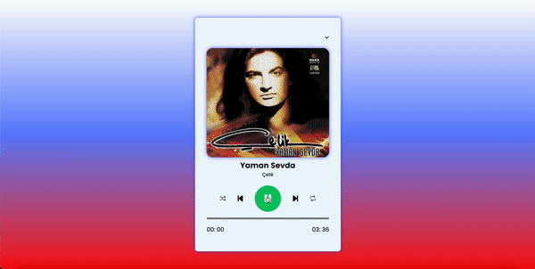

<h1> Mp3 Player</h1>

<h2> Teknoloji </h2>

HTML, CSS ve JavaScript

<h2> Açıklama </h2>

"HTML, CSS ve JavaScript kullanarak geliştirdiğim basit ve şık bir MP3 player tasarımı! 🎶 Kodlamaya olan ilgimi pratik bir örnekle sergiledim.

<h2> Ekran Görüntüsü </h2>

